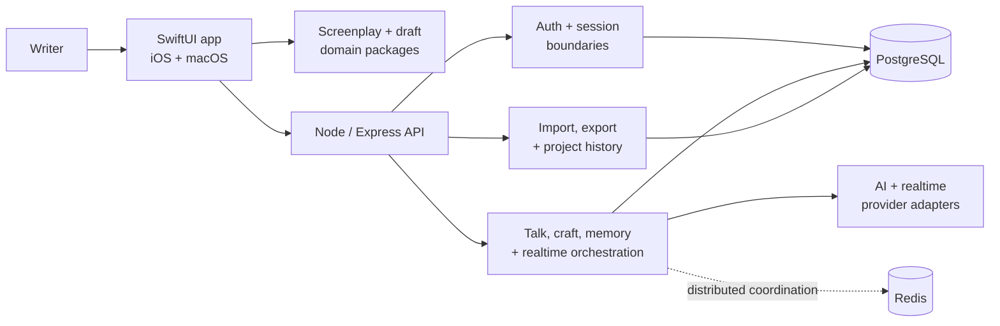

# io.them

> A voice-first AI screenplay studio that turns creative intent into production-ready pages.

[](https://github.com/FramehouseStudios/them/actions/workflows/quality-gate.yml)


io.them is a native writing environment for screenwriters who think in fragments, images, performances, and spoken ideas—not only in finished pages. Its creative companion, Clementine, helps a writer move from voice or text to correctly structured screenplay material while preserving project context, character intent, tone, and authorship.

The product principle is deliberately demanding: the technology should disappear quickly enough for the writer to stay inside the scene.

## At a glance

| | |
| --- | --- |
| **Product** | Native iOS and macOS screenplay studio with voice, text, realtime collaboration, memory, and professional export workflows. |
| **Core challenge** | Convert ambiguous creative intent into useful pages without flattening the writer's voice or losing edits during streaming, retries, or restore. |
| **Architecture** | SwiftUI client and domain packages, modular Node/Express API, PostgreSQL persistence, optional Redis coordination, and provider adapters. |
| **Engineering focus** | Realtime state reconciliation, deterministic screenplay formatting, auth/session safety, durable project memory, observability, and release automation. |
| **Current stage** | V1 release candidate at the human-owned signing, production configuration, and final device-smoke boundary. |

## Product experience

### Voice to page

- Capture a spoken beat, line, scene idea, or structural request.
- Stream useful partial feedback while the authoritative page result is prepared.
- Format natural language into screenplay-aware scene headings, action, character cues, parentheticals, dialogue, and transitions.
- Preserve manual edits when voice playback, streamed text, and backend results arrive at different times.

### A companion with creative continuity

- Maintain project, character, tone, story, and session context across writing turns.
- Support distinct coaching, co-writing, comfort, and story-development intents.
- Surface memory and provenance controls so creative context remains understandable and correctable.
- Restore drafts and conversation state across relaunches and interrupted sessions.

### A professional writing surface

- Continue scenes, rewrite selections, polish dialogue, explore structure, and generate alternatives.
- Import and export screenplay material through Fountain and production-oriented document formats.
- Track project versions, comments, history, and recovery state.
- Keep the page authoritative: generated suggestions do not silently overwrite a writer's work.

## System architecture



The client owns interaction quality and local continuity. The backend owns identity boundaries, authoritative persistence, orchestration, provider access, and operational controls. Provider-specific behavior is kept behind adapters so product logic can be tested without depending on a live model response.

## Engineering highlights

- **Authoritative state reconciliation.** Voice playback, streamed partials, local edits, backend acknowledgements, and restored drafts are reconciled explicitly instead of relying on last-write-wins UI state.
- **Screenplay-native domain logic.** Fountain parsing and formatting live in focused Swift packages with rules for common screenplay elements and natural-language input.
- **Layered reliability.** Requests use idempotency, per-session serialization, concurrency controls, bounded retries, recovery paths, and persistent outbox patterns where the workflow requires them.
- **Identity and privacy boundaries.** Email/password and Sign in with Apple flows are backed by rotating sessions, revocation, verification/reset contracts, route protection, per-user project isolation, and PII-safe request logging.
- **Durable creative memory.** Memory, craft signals, project history, and companion state have explicit schemas and persistence contracts rather than being hidden exclusively inside prompts.
- **Provider and cost controls.** Model access stays server-side, health is observable, fallback behavior is bounded, and paid-provider routes are protected.
- **Testable AI behavior.** Canon, prompt, memory, formatting, failover, voice-to-page, and studio interaction evals supplement conventional unit and integration tests.

## Quality and release discipline

The repository treats release readiness as an engineering system, not a final checklist.

| Layer | Evidence in the repository |
| --- | --- |
| Swift application | Unit/state tests, package tests, platform builds, accessibility identifiers, and focused UI smoke scenarios. |
| Backend | 100 automated test modules covering routes, auth, persistence, memory, realtime behavior, exports, isolation, and failure recovery. |
| AI/product behavior | 70+ deterministic eval and smoke runners for prompt contracts, screenplay behavior, realtime failover, restore, and visual interaction paths. |
| Data | Ordered SQL migrations plus a CI gate that applies migrations to a fresh PostgreSQL 16 service. |
| Delivery | Quality-gate and release-preflight workflows, backend image build, secret validation, launch diagnostics, and release-candidate evidence. |

Primary verification commands:

```bash
# Backend unit and integration suite
cd backend
npm test

# Product-level V1 behavior
npm run eval:v1-smokes

# Repository release gate (from the repository root)
cd ..
scripts/run_release_preflight.sh
```

## Technology

| Area | Stack |
| --- | --- |
| Client | Swift, SwiftUI, Swift Concurrency, AVFoundation, Speech, AuthenticationServices, WebRTC/realtime transport |
| Domain | Swift Package Manager, Fountain parsing/formatting, draft and screenplay state models |
| Backend | Node.js 20, Express, modular route/services architecture |
| Data | PostgreSQL 16, SQL migrations, JSON development adapters, Redis coordination |
| AI | Server-side model orchestration, realtime sessions, structured prompt and eval contracts |
| Delivery | GitHub Actions, Docker build verification, scripted quality gates, release preflight |

## Repository guide

| Path | Responsibility |
| --- | --- |
| [`them/`](them/) | Active SwiftUI application, clients, orchestration, realtime, privacy manifest, and release material. |
| [`Packages/`](Packages/) | Focused screenplay and draft-domain Swift packages. |
| [`themTests/`](themTests/) | Application behavior, client, state, and regression tests. |
| [`backend/`](backend/) | API, auth, stores, provider adapters, migrations, tests, and product evals. |
| [`scripts/`](scripts/) | Quality, smoke, migration, release, and project automation. |
| [`docs/`](docs/) | API contracts, architecture decisions, launch evidence, product specs, and runbooks. |
| [`tasks/`](tasks/) | Reviewable project task records and implementation history. |

## Run locally

### Prerequisites

- macOS with Xcode and the iOS/macOS 26 SDKs
- Node.js 20 and npm
- PostgreSQL for persistence-backed development; Redis only for distributed coordination scenarios
- Provider credentials only when exercising live AI or realtime paths

### Start the backend

```bash
cd backend
npm install
npm run start:local
```

The local API defaults to `http://localhost:3000`. Keep provider keys, app tokens, signing material, and production URLs in ignored local configuration or the deployment platform—never in source control.

### Run the app

Open [`them.xcodeproj`](them.xcodeproj) in Xcode, choose the shared `them` scheme, and run on macOS or an iOS simulator.

Command-line verification is also available:

```bash
xcodebuild -project them.xcodeproj -scheme them -destination 'platform=macOS' test
xcodebuild -project them.xcodeproj -scheme them -destination 'generic/platform=iOS' build
```

### Prepare a release candidate

Release proof uses an ignored, human-owned configuration file:

```bash
cp them/Release.local.env.example them/Release.local.env
chmod 600 them/Release.local.env
scripts/run_release_preflight.sh
```

Production signing, backend URL, app token, provider credentials, privacy answers, and final device smoke approval are intentionally outside source control.

## Security and trust model

- Secrets and paid-provider access remain server-side.
- Protected routes validate both application and user/session boundaries.
- Auth supports refresh rotation, session listing/revocation, verification, password reset, and Apple identity exchange.
- Project and memory operations enforce ownership rather than trusting client-supplied identity headers.
- Request logging excludes query-string credentials and sensitive auth payloads.
- Privacy-sensitive schemas and release mappings are documented and reviewed alongside the code that implements them.

Relevant references: [`docs/schemas/INDEX.md`](docs/schemas/INDEX.md), [`them/PRIVACY_POLICY.md`](them/PRIVACY_POLICY.md), and [`them/APP_STORE_PRIVACY_MAPPING.md`](them/APP_STORE_PRIVACY_MAPPING.md).

## Product standard

Every visible control must perform a useful action, explain why it is unavailable, or be removed. Generated work must remain reviewable. Failure states must be understandable. The app should help a writer reach a usable scene faster without asking them to manage the machinery behind it.

That standard—not the presence of AI—is what defines io.them.
